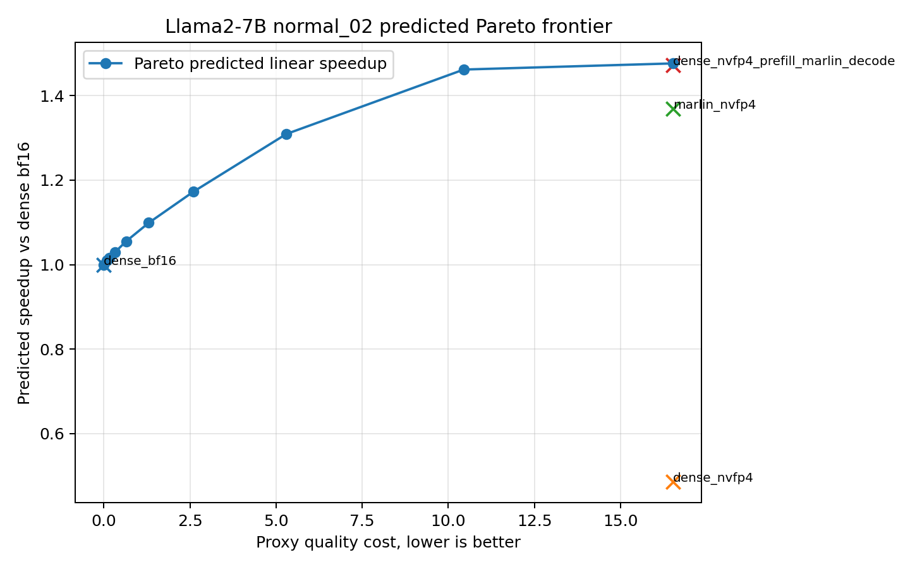
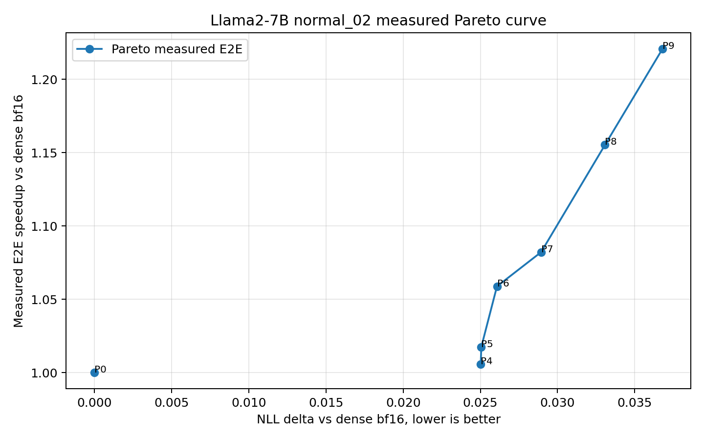
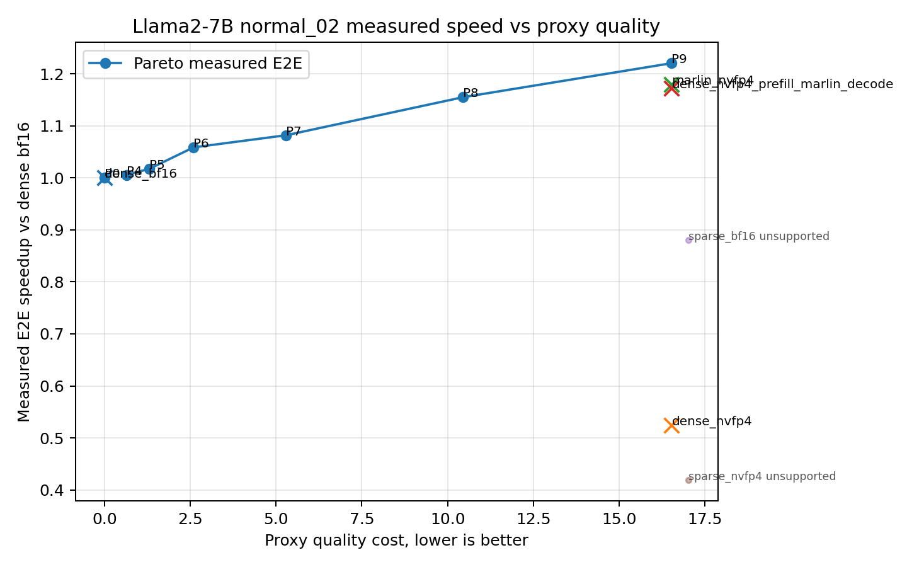
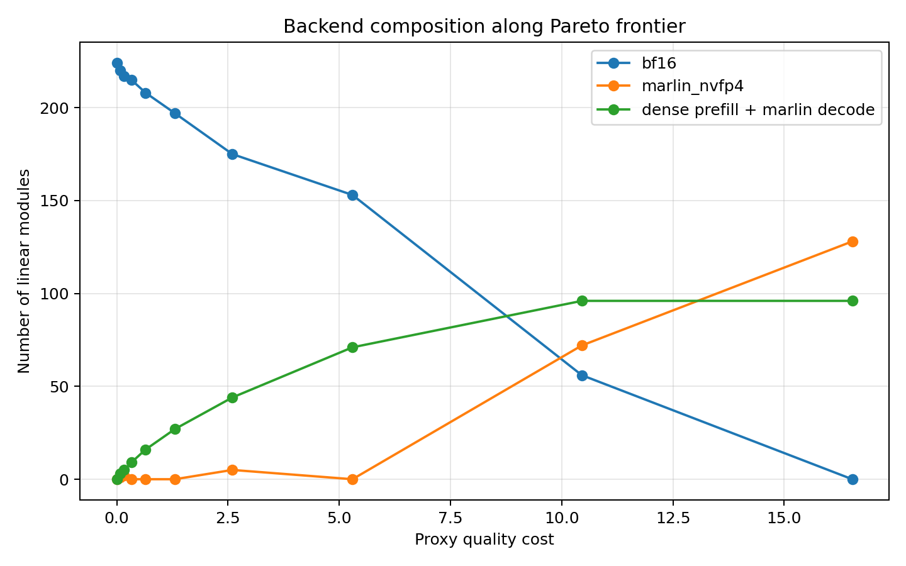

# Llama2-7B Normal02 Complete Pareto Summary

## Scope

- Model: `llama2-7b`
- Scenario: `normal_02`, batch 1, prefill 16384, decode 256
- Goal: validate and present a quality-speed Pareto curve, not only one operating point.

## Key Results

- DP sampled 10 Pareto budget points: `P0, P1, P2, P3, P4, P5, P6, P7, P8, P9`.
- E2E/NLL validation currently covers 7 points: `P0, P4, P5, P6, P7, P8, P9`.
- The earlier OOM for P4/P5/P6/P8 was a validator artifact from running many policies in one process; process-per-repeat validation fixes it.
- Best measured Pareto point is P9: `1.221x` E2E speedup, NLL delta `0.036796`.
- ARC-Challenge limit=128 remains too coarse to rank these points; NLL is the more useful validation metric here.

## Plots

## Pareto Points

| point | proxy cost | NLL delta | ARC-C acc_norm | predicted speedup | E2E speedup | E2E mean ms | backend shape |
|---:|---:|---:|---:|---:|---:|---:|---|
| P0 | 0.0000 | 0.000000 | 0.460938 | 1.000x | 1.000x | 9026.0 | `224 bf16, 0 marlin, 0 hybrid` |
| P1 | 0.0794 | -- | -- | 1.010x | -- | -- | `220 bf16, 1 marlin, 3 hybrid` |
| P2 | 0.1584 | -- | -- | 1.016x | -- | -- | `217 bf16, 2 marlin, 5 hybrid` |
| P3 | 0.3259 | -- | -- | 1.030x | -- | -- | `215 bf16, 0 marlin, 9 hybrid` |
| P4 | 0.6481 | 0.025023 | 0.468750 | 1.055x | 1.006x | 8973.6 | `208 bf16, 0 marlin, 16 hybrid` |
| P5 | 1.3055 | 0.025061 | 0.460938 | 1.099x | 1.017x | 8871.1 | `197 bf16, 0 marlin, 27 hybrid` |
| P6 | 2.5973 | 0.026076 | 0.460938 | 1.173x | 1.059x | 8524.9 | `175 bf16, 5 marlin, 44 hybrid` |
| P7 | 5.2974 | 0.028936 | 0.460938 | 1.309x | 1.082x | 8340.8 | `153 bf16, 0 marlin, 71 hybrid` |
| P8 | 10.4523 | 0.033074 | 0.445312 | 1.462x | 1.155x | 7812.8 | `56 bf16, 72 marlin, 96 hybrid` |
| P9 | 16.5301 | 0.036796 | 0.460938 | 1.476x | 1.221x | 7394.2 | `0 bf16, 128 marlin, 96 hybrid` |

## Uniform Baselines

Uniform baselines are useful controls, but only `dense_bf16`, `dense_nvfp4`, `marlin_nvfp4`, and `dense_nvfp4_prefill_marlin_decode` are in the current normal_02 Pareto candidate set. Sparse single-method E2E runs exist, but sparse rows are marked unsupported in this per-linear normal_02 optimizer because decode `M=1` violates the current sparse-kernel shape constraints.

| method | in Pareto candidate set | proxy cost | predicted speedup | measured E2E speedup | E2E ms | note |
|---|---:|---:|---:|---:|---:|---|
| `dense_bf16` | yes | 0.0000 | 1.000x | 1.000x | 9101.4 |  |
| `dense_nvfp4` | yes | 16.5301 | 0.486x | 0.525x | 17348.9 |  |
| `marlin_nvfp4` | yes | 16.5301 | 1.370x | 1.179x | 7717.9 |  |
| `dense_nvfp4_prefill_marlin_decode` | yes | 16.5301 | 1.472x | 1.172x | 7762.4 |  |
| `sparse_bf16` | no | -- | -- | 0.881x | 10334.7 | all rows unsupported |
| `sparse_nvfp4` | no | -- | -- | 0.419x | 21729.4 | all rows unsupported |

## Interpretation

- In the predicted proxy-latency space, the Pareto optimizer dominates supported uniform methods by construction because uniform policies are a subset of the per-module choice space.
- In measured E2E space, P9 is faster than the supported uniform `marlin_nvfp4` and `dense_nvfp4_prefill_marlin_decode` baselines while using the same proxy quality cost endpoint.
- Uniform baseline E2E numbers come from the existing 003 warm-E2E-aligned summary, while Pareto points use the newer process-per-repeat protocol. They are close enough for diagnosis, but final figures should remeasure uniform baselines with the same process-per-repeat protocol.
- The full measured curve is monotonic in speed from P0 to P9, but gains are small at low budgets: P4/P5 are close to dense, P6/P7 start to move, and P8/P9 carry most of the speed improvement.
- The NLL curve is monotonic with proxy cost for validated points, which supports using the proxy as the optimization constraint.
- ARC-Challenge limit=128 does not provide enough resolution; it should not be used as the main curve-quality metric.

## What This Does Not Prove Yet

- It does not yet prove dominance over sparse uniform methods inside the same optimizer, because sparse methods are unsupported by the current normal_02 per-linear candidate table.
- It does not yet provide a dense continuous Pareto frontier; the current curve is a 10-budget DP sample with 7 E2E-validated points.
- It does not yet validate full ARC-Challenge for every point; current task validation is limit=128.

## Next Steps To完善 Llama2-7B

1. Generate a denser frontier, ideally all non-dominated DP states or at least 30-50 budget points, then validate a selected subset.
2. Add a formal uniform-dominance table/plot for supported methods in both predicted space and measured E2E space.
3. Remeasure supported uniform baselines with the same process-per-repeat protocol used for Pareto points.
4. Run full ARC-Challenge, not limit=128, for representative points P0/P6/P8/P9 and supported uniform baselines.
5. Decide how to handle sparse methods in normal_02: either exclude them explicitly because decode `M=1` is unsupported in the optimizer, or build a padded/compatible sparse candidate path and include them fairly.
6. Calibrate the quality proxy weights using NLL deltas from the measured curve instead of keeping layer/family weights purely heuristic.
7. Make process-per-repeat E2E validation the only accepted timing protocol for this scenario.

## Files

- `pareto_joined_summary.csv`: joined proxy, NLL, ARC limit=128, predicted latency, and measured E2E for Pareto points.
- `uniform_baseline_summary.csv`: supported and unsupported uniform controls.
- `dominance_summary.csv`: automatic dominance check for supported uniform methods.
- `*.png`: plots shown above.
