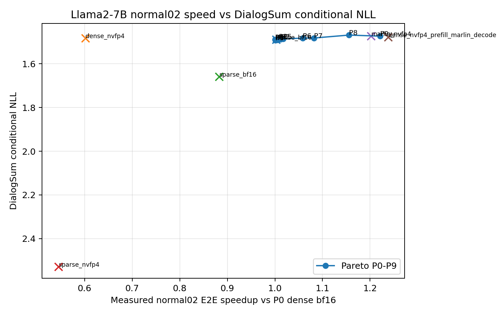
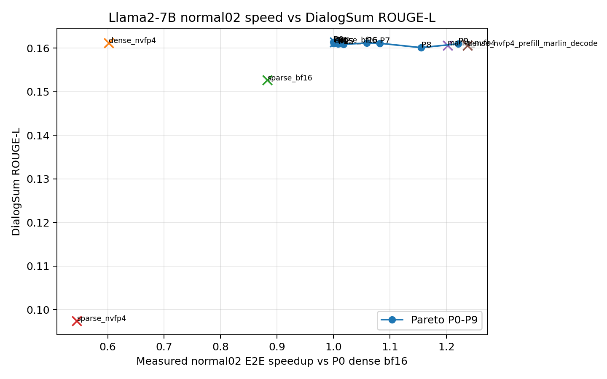

# Llama2-7B DialogSum Pareto Summary

This report uses the `normal02` speed scenario and DialogSum quality evaluation. All P0-P9 and uniform rows were evaluated with real compressed artifacts and real runtime kernels. DialogSum has 1500 test samples here. ROUGE-L is computed from greedy generated summaries. Conditional NLL is computed on reference summary tokens with prompt prefill followed by autoregressive decode, so prefill/decode backend differences are exercised.

## Artifacts

- `dialogsum_pareto_summary.csv`: merged table for P0-P9 and all uniform points.
- `correlations.csv`: Pearson/Spearman correlations between NLL, ROUGE-L, and predicted quality cost.
- `speedup_vs_nll.png`: measured speedup vs DialogSum NLL, lower NLL is better.
- `speedup_vs_rougeL.png`: measured speedup vs DialogSum ROUGE-L, higher ROUGE-L is better.

## Headline Results

| label | kind | speedup vs P0 | E2E ms | NLL | ROUGE-L |
|---|---|---:|---:|---:|---:|
| P0 | pareto | 1.0000 | 9025.96 | 1.488905 | 0.161372 |
| P6 | pareto | 1.0588 | 8524.87 | 1.482208 | 0.161169 |
| P7 | pareto | 1.0821 | 8340.85 | 1.481658 | 0.161136 |
| P8 | pareto | 1.1553 | 7812.83 | 1.468416 | 0.160130 |
| P9 | pareto | 1.2207 | 7394.15 | 1.473035 | 0.160999 |
| dense_bf16 | uniform | 1.0024 | 9004.65 | 1.488905 | 0.161372 |
| dense_nvfp4 | uniform | 0.6020 | 14994.09 | 1.482418 | 0.161206 |
| sparse_bf16 | uniform | 0.8830 | 10222.32 | 1.658426 | 0.152663 |
| sparse_nvfp4 | uniform | 0.5448 | 16566.47 | 2.528722 | 0.097432 |
| marlin_nvfp4 | uniform | 1.2022 | 7507.97 | 1.472235 | 0.160640 |
| dense_nvfp4_prefill_marlin_decode | uniform | 1.2376 | 7292.93 | 1.477486 | 0.160599 |

## Pareto Interpretation

For speedup vs NLL, the non-dominated rows are `P8`, `P9`, `marlin_nvfp4`, and `dense_nvfp4_prefill_marlin_decode`. The learned P8/P9 points avoid the bad sparse uniform methods and give useful mid/high-speed tradeoffs, but the fastest endpoint is still the uniform hybrid row.

For speedup vs ROUGE-L, the non-dominated rows are `P4`, `P6`, `P7`, `P9`, `dense_bf16`, and `dense_nvfp4_prefill_marlin_decode`. ROUGE-L values for most non-sparse points are very close, so the ordering is fragile. The sparse uniform methods are clearly inferior on both quality metrics and speed in this scenario.

The current P0-P9 curve does not completely dominate all uniform methods. It dominates the sparse uniform points, but at the fast end the uniform hybrid method remains faster than P9 with lower ROUGE-L and worse NLL than the best NLL point. This means the next optimization pass should explicitly include the hybrid uniform endpoint as a reachable candidate or constraint target.

## Correlations

| x | y | n | Pearson | Spearman |
|---|---|---:|---:|---:|
| conditional_nll | ROUGE-L | 16 | -0.9984 | 0.1576 |
| quality_cost | conditional_nll | 14 | -0.7981 | -0.7796 |
| quality_cost | ROUGE-L | 14 | -0.5408 | -0.5858 |

The near-perfect Pearson correlation between NLL and ROUGE-L is misleading because ROUGE-L has a very small dynamic range for non-sparse points. Spearman is weak, so NLL is not yet a reliable rank proxy for DialogSum ROUGE-L in this run. Also, the predicted quality cost is negatively correlated with measured NLL, which means the current proxy is not calibrated for this DialogSum decode setting.

## Plots

## Recommended Next Steps

1. Recalibrate the quality proxy for decode-generation workloads. The current proxy was useful for constructing candidate policies, but its direction is wrong against DialogSum NLL in this run.
2. Add the uniform hybrid endpoint into the constrained optimizer as an explicit anchor. The learned curve should be able to match or beat it, otherwise the fastest Pareto region is incomplete.
3. Rerun a smaller targeted policy search around P7-P9 and the hybrid endpoint, rather than adding more uniformly spaced points across the full range.
4. Reduce generation warning noise permanently in the evaluation wrapper and keep checkpointed JSONL generation enabled for all future full DialogSum runs.
