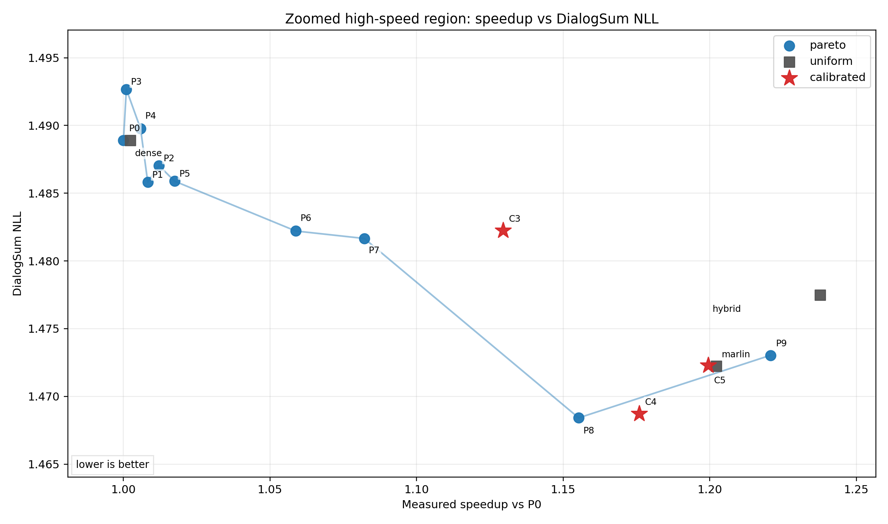
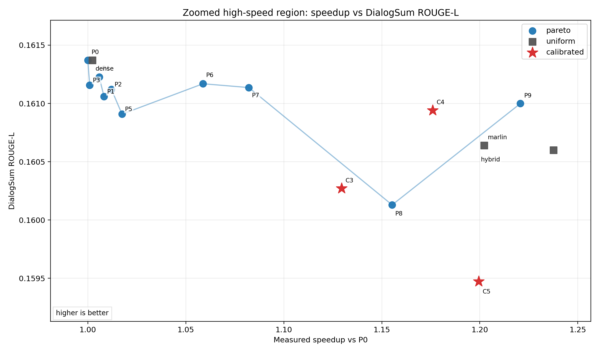
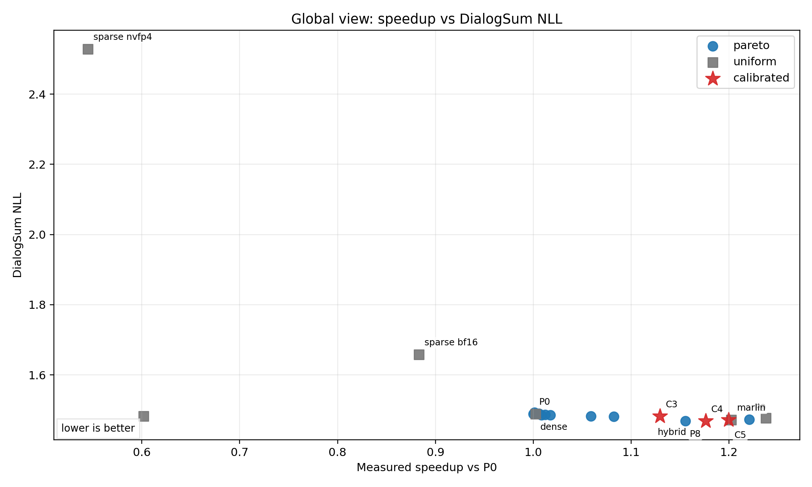
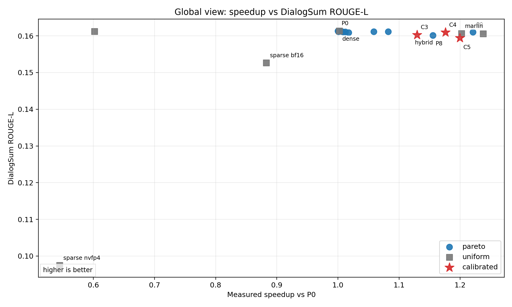

# Targeted DialogSum-Calibrated Pareto

This experiment recalibrates the original per-module quality proxy with full DialogSum uniform results, then searches only around the high-speed `normal02` region. The calibrated candidates C3/C4/C5 are new policies generated in this 013 experiment; they are not part of the original P0-P9 curve.

Naming note: C3/C4/C5 mean calibrated candidate point 3/4/5 from the 013 targeted search. I renamed them from the earlier T3/T4/T5 wording to avoid implying that there was a pre-existing `target point` concept.

## Calibrated Candidate Results

| label | speedup vs P0 | E2E ms | NLL | ROUGE-L | calibrated cost |
|---|---:|---:|---:|---:|---:|
| C3 | 1.1295 | 7985.62 | 1.482247 | 0.160271 | 0.034154 |
| C4 | 1.1759 | 7670.15 | 1.468718 | 0.160942 | 0.048328 |
| C5 | 1.1994 | 7519.89 | 1.472280 | 0.159472 | 0.063074 |

## Non-Dominated Rows

- Speedup vs NLL: P8, C4, marlin_nvfp4, P9, dense_nvfp4_prefill_marlin_decode.
- Speedup vs ROUGE-L: dense_bf16, P4, P6, P7, P9, dense_nvfp4_prefill_marlin_decode.

## Interpretation

C4 is the useful point from this pass: it reaches 1.176x speedup with NLL 1.468718 and ROUGE-L 0.160942. It is close to original P8 on NLL while giving better ROUGE-L, but it is slower than original P9 and the uniform hybrid endpoint.

C5 is close to the marlin/hybrid speed region, but its ROUGE-L is lower than the original high-speed points. It should not be treated as an improved endpoint.

This confirms the method is moving in the right direction for mid/high-speed tradeoffs, but the calibrated proxy still does not produce a curve that dominates the uniform hybrid endpoint.

## Next Step

The next optimization pass should use a latency-constrained formulation with the measured hybrid endpoint as an explicit target, and add a minimum ROUGE/NLL guardrail from C4/P8/P9 rather than relying only on the calibrated aggregate budget.

## Plots

The zoomed plots are the main plots to inspect. The global plots are mainly sanity checks because sparse uniform points stretch the y-axis and make the useful high-speed region hard to read.

