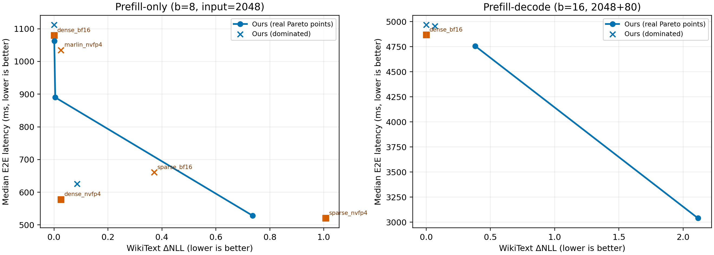

# Llama2-7B-Chat measured Pareto validation

Quality is the real 100-block WikiText pooled ΔNLL; latency is the median of repeated fresh-process vLLM measurements. Lower is better on both axes.

## Prefill-only

Protocol: batch 8, input 2048, `gpu_memory_utilization=0.9`. The uniform references use the established baseline artifact; selected policies use the same prefill benchmark protocol. `globally_pareto_kept` is computed directly from the displayed measured numbers.

| family | label | measured_wikitext_delta_nll | e2e_median_ms | globally_pareto_kept |
|---|---|---|---|---|
| ours | ours_point_0 | 0.0000 | 1111.7934 | False |
| ours | ours_point_4 | 0.0011 | 1062.2048 | True |
| ours | ours_point_8 | 0.0047 | 890.0238 | True |
| ours | ours_point_12 | 0.0857 | 625.4506 | False |
| ours | ours_point_16 | 0.7359 | 528.4376 | True |
| uniform_reference | dense_bf16 | 0.0000 | 1079.5359 | True |
| uniform_reference | dense_nvfp4 | 0.0260 | 578.1634 | True |
| uniform_reference | sparse_bf16 | 0.3708 | 660.9484 | False |
| uniform_reference | sparse_nvfp4 | 1.0068 | 520.6317 | True |
| uniform_reference | marlin_nvfp4 | 0.0260 | 1034.9918 | False |

## Prefill-decode

Protocol: batch 16, input 2048, output 80, phase switch enabled, `gpu_memory_utilization=0.9`. Ours uses the historical formal phase runner and 10 repeated fresh-process measurements for output lengths 1 and 80. `dense_bf16` is the corresponding historical formal baseline summary. Point 8 is excluded because it OOMs under this formal configuration.

| family | label | measured_wikitext_delta_nll | e2e_median_ms | globally_pareto_kept |
|---|---|---|---|---|
| uniform_reference | dense_bf16 | 0.0000 | 4868.0678 | True |
| ours | ours_point_0 | 0.0000 | 4967.4399 | False |
| ours | ours_point_3 | 0.0669 | 4954.3282 | False |
| ours | ours_point_6 | 0.3809 | 4756.8160 | True |
| ours | ours_point_11 | 2.1151 | 3039.7840 | True |

## Readout

- Decode: points 0 and 3 are dominated by dense-bf16 in the formal remeasurement. Points 6 and 11 form the measured mixed-policy frontier. Point 11 is exactly the previously exported max-speed strategy (prefill dense-NVFP4; decode W4A16), verified by identical per-module phase assignments.
- Prefill-only: real ours points 4, 8, and 16 form the retained heterogeneous part of the frontier. Dense-bf16, dense-nvfp4, and sparse-nvfp4 remain valid uniform boundary anchors; these are retained transparently rather than being incorrectly claimed as dominated.
